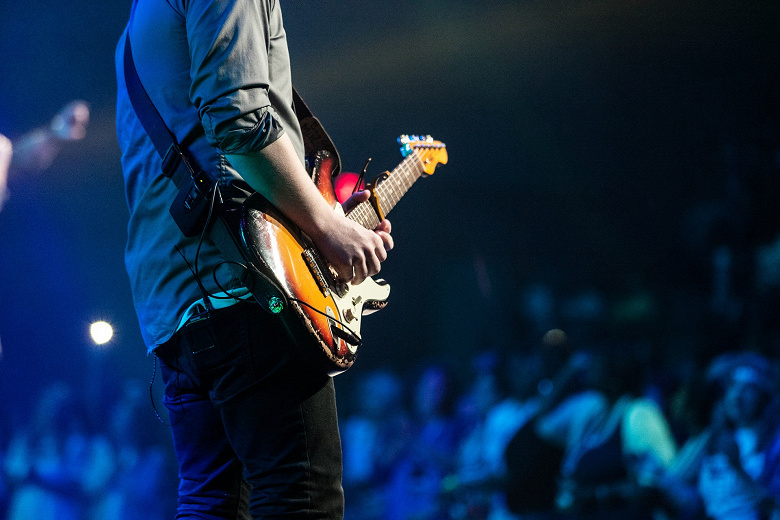

# Михаил

### Ключевые навыки
- HTML
- CSS
- GIT
- JS
- PHP
- 1C BITRIX

 ### SOFT SKILLS

- Умение работать в команде
- Умение ставить и достигать поставленных целей
- Активная жизненная позиция и позитивная эмоциональная установка
- Душа компании

### Проекты

Нейронная сеть, котрая пишет РОК музыку
